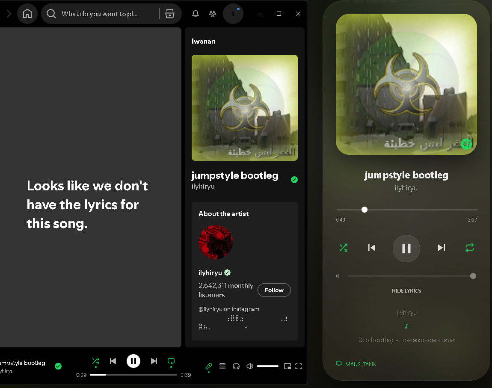

<div align="center">

# 💧 LiquidGlass for PC

A **glassmorphism Spotify desktop remote** inspired by Apple’s **Liquid Glass** design language.

Dynamic blur • Reactive colors • Device switching • Spotify controls • Built with Python + PyWebView


<br>


</div>

---

> ⚠️ **Work in progress** — expect bugs, improvements, and new features.

---

# ✨ About

**LiquidGlass for PC** is a desktop Spotify remote featuring a **dynamic glassmorphism interface**, reactive colors extracted from album artwork, animated blur effects, and seamless Spotify device switching.

Inspired by Apple’s **Liquid Glass** aesthetic while creating a more immersive desktop Spotify experience.

Built for people who want music controls to feel alive.

---

# ❓ Why LiquidGlass?

Most Spotify remotes feel static.

LiquidGlass adapts in real time using:

- 🎨 Album artwork color extraction
- 💧 Dynamic blur effects
- 🌈 Reactive backgrounds
- 🫧 Animated UI elements
- ⚡ Device syncing & playback transfer

Creating a desktop experience that changes with your music.

---

# 📌 Notes

- 👾 The app may occasionally lag or freeze. Restarting usually fixes the issue.
- 👷 Cross-device support and stability improvements are currently being worked on.
- 🚧 Expect bugs while development continues.

---

# ⚠️ Important

- 🛜 A stable internet connection is recommended for smooth playback syncing.
- 🌐 Poor or unstable connections may cause delays or playback issues.
- 🎵 Spotify Premium is required for playback control via Spotify API.

---

# ✨ Features

- 🎨 Dynamic colors extracted from album artwork
- 💧 Liquid Glass-inspired UI with animated blur
- 🎵 Full Spotify playback controls
- 🔁 Shuffle & repeat support
- ⏱ Live playback progress tracking
- 🔊 Volume adjustment
- 🌈 Background blur synced to current track colors
- 🫧 Reactive animated blobs
- 🖥 Spotify device switching support
- ⚡ Auto wake/reconnect inactive Spotify devices
- 🪟 Frameless desktop window with custom controls
- 📃 Has a Lyrics feature. Spotify has no Lyrics api so im using a diffrent one meaning it can find Lyrics to songs spotify has no lyrics

---

# 🎬 Demo

<p align="center">

</p>

---

# 📸 Screenshots

### Main Interface


### Lyrics



---

# 💻 Compatibility

| Platform | Supported |
|----------|------------|
| Windows | ✅ |
| macOS | ❌ |
| Linux | ❌ |

---

# 🚀 Getting Started

Clone the repository:

```bash
git clone https://github.com/mekhanonspotify-svg/LiquidGlass-for-PC.git

cd LiquidGlass-for-PC
```

Or download the ZIP directly from GitHub.

---

## 📦 Install Dependencies

Install all requirements:

```bash
pip install -r requirements.txt
```

Or manually:

```bash
pip install pywebview requests spotipy PyQt6 colorthief
```

---

# ▶ Run the Application

Start LiquidGlass:

```bash
python Main.py
```

The first launch opens Spotify authentication automatically.

After connecting, LiquidGlass detects available Spotify devices and allows playback transfer between them.

---

## ☑️ After Installing
☑️ make sure it works keep these files:
`- Main.py`
`- index.html`
`- API.JSON`

✖️ Delete These:
`- Images`
`- LICENSE`
`- README.md`
`- latest.version`
`- requiremets.txt`

## 📄 Note
- ⚠️ if you have a file not on this list keep it. Spotifys API created it


---

# 🐞 Known Issues

Current issues being worked on:

- Occasional lag during playback syncing
- Rare freezes/crashes
- Delayed updates on unstable internet connections
- Device switching may occasionally take extra time

Restarting the app fixes most temporary issues.

---

# 🛠 Built With

- Python
- PyWebView
- PyQt6
- Spotipy
- HTML / CSS / JavaScript
- ColorThief

---

# 🗺 Roadmap

Planned improvements:

- [ ] Mini mode
- [ ] Lyrics support
- [ ] More customization options
- [ ] Performance optimizations
- [ ] Additional visual effects
- [ ] Better multi-device support
- [ ] Improved stability

---

# 🤝 Contributing

Contributions, ideas, and bug reports are welcome.

Open an issue or submit a pull request if you'd like to help improve LiquidGlass.

---

# 📄 License

Released under the **MIT License**.

---

<div align="center">

### Made with 💖 by **SoulNova**

Inspired by Apple’s Liquid Glass aesthetic.

⭐ If you like the project, consider starring the repository.

</div>
