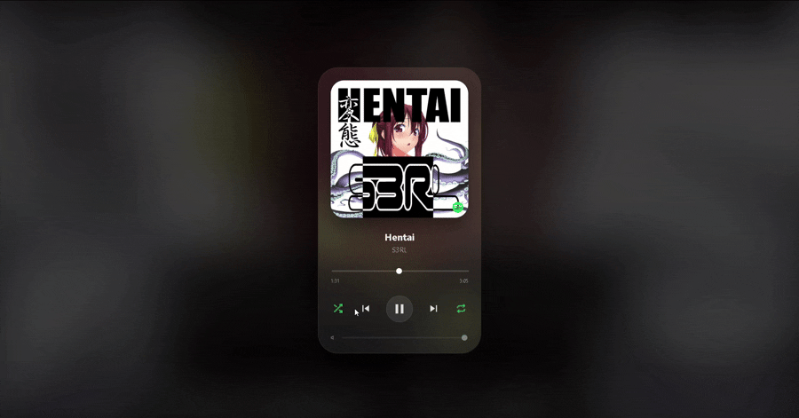

<div align="center">

# 💧 LiquidGlass for PC

A **glassmorphism Spotify remote** inspired by Apple’s **Liquid Glass** design language.

Dynamic blur • Reactive colors • Spotify controls • Python + PyWebView


<br>


</div>

---

## ✨ Features

- 🎨 Dynamic colors extracted from album artwork
- 💧 Liquid glass inspired UI with animated blur
- 🎵 Spotify playback controls
- 🔁 Shuffle & repeat support
- ⏱ Live playback progress tracking
- 🔊 Volume control
- 🌈 Background blur synced to current track colors
- 🫧 Reactive animated blobs

---

## 🎬 Demo

<p align="center">

</p>

---

## 📸 Screenshots

### Main Interface


### Alternate View


---

# 🚀 Getting Started

Clone the repository:

```bash
git clone https://github.com/mekhanonspotify-svg/LiquidGlass-for-PC.git
cd LiquidGlass-for-PC
```

Or download the ZIP directly.

---

## 📦 Install Dependencies

Install all requirements:

```bash
pip install -r requirements.txt
```

Or install manually:

```bash
pip install pywebview requests spotipy PyQt6 colorthief
```

---

## 🔑 Spotify API Setup

Create a file named:

```txt
API.JSON
```

Add your Spotify credentials:

```json
{
  "spotify_id": "YOUR_CLIENT_ID",
  "spotify_secret": "YOUR_CLIENT_SECRET"
}
```

Get credentials from:

https://developer.spotify.com/dashboard

Set your **Redirect URI** to:

```txt
http://127.0.0.1:8888/callback
```

---

## ▶ Run the Application

Start the app:

```bash
python main.py
```

The first launch opens a browser window for Spotify authentication.

---

## 🛠 Built With

- Python
- PyWebView
- PyQt6
- Spotipy
- HTML / CSS / JavaScript
- ColorThief

---

## 🗺 Roadmap

- [ ] Mini mode
- [ ] Lyrics support
- [ ] Better customization options
- [ ] Performance improvements

---

## 📄 License

Released under the **MIT License**.

---

<div align="center">

### Made with 💖 by **SoulNova**

Inspired by Apple’s Liquid Glass aesthetic.

</div>
